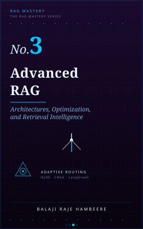
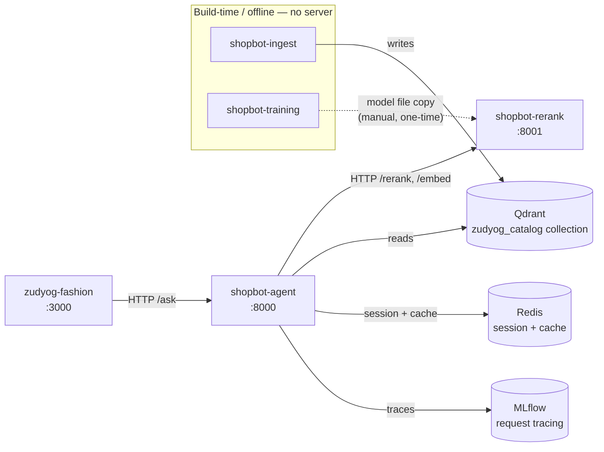
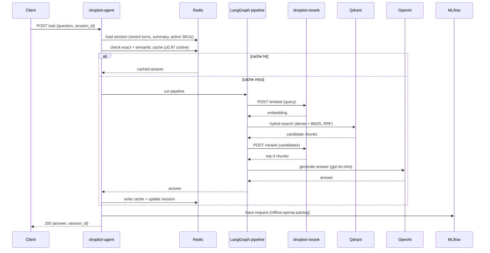
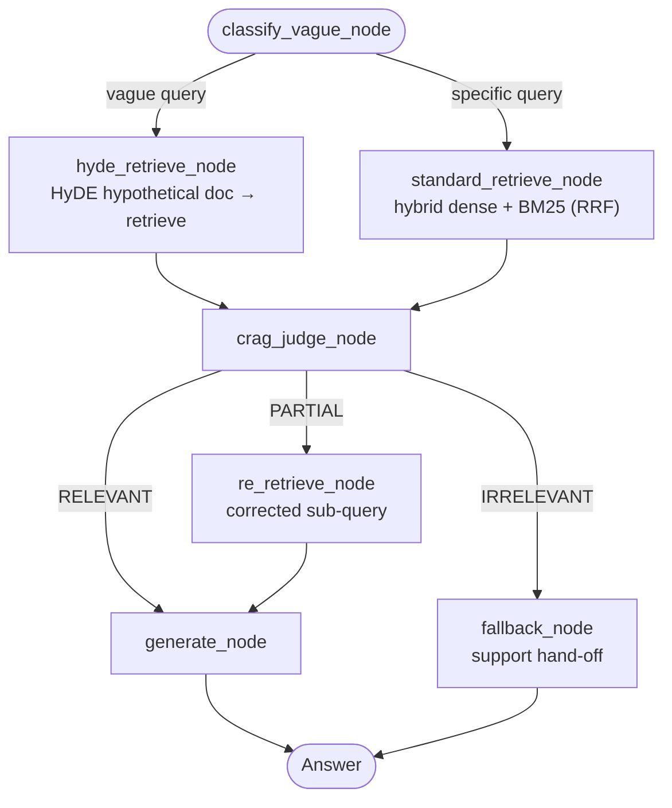
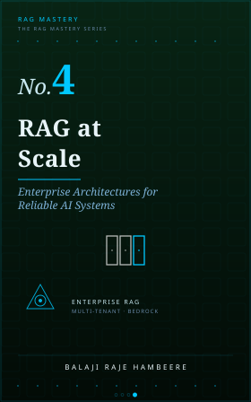

<div align="center">



# Advanced RAG — Architectures, Optimization, and Retrieval Intelligence

**ShopBot v3**: the advanced-RAG upgrade of an open-source Retrieval-Augmented Generation (RAG) chatbot — the complete companion codebase for *Advanced RAG*, Book 3 of the RAG Mastery Series.

### 📖 Every line of this code is explained, chapter by chapter, in the book.

[](https://www.amazon.com/dp/B0H3FRPV21/)

This repo shows you *what* was built. The book shows you *why* — every design decision, every dead end, every real evaluation score, written as the chapters that produced this exact code.

[](https://www.python.org/)
[](https://fastapi.tiangolo.com/)
[](https://www.langchain.com/langgraph)
[](https://qdrant.tech/)
[](https://redis.io/)
[](https://onnx.ai/)
[](https://github.com/explodinggradients/ragas)
[](https://mlflow.org/)
[](https://www.docker.com/)
[](https://nextjs.org/)

📖 [Get the book on Amazon](https://www.amazon.com/dp/B0H3FRPV21/) · ⭐ Star this repo if it helped you

</div>

---

## What this is

This repository is the real, working codebase behind **ShopBot v3** — the same RAG product assistant for **zUdyog Fashion** from Books 1–2, rebuilt again to close the failure modes Book 2's own campaign traffic surfaced. Book 2 ended at 91% success on seven-thousand-queries-a-day traffic. Book 3 starts from the 9% that remained, sorted by hand from the failed-query log into four distinct categories, and closes each one by changing the *shape* of the pipeline rather than bolting on another component.

If you're searching for a **LangGraph RAG orchestration example in Python**, a **HyDE (Hypothetical Document Embeddings) implementation for vague queries**, a **Corrective RAG (CRAG) judge with re-retrieval**, a **fine-tuned + ONNX INT8-quantised embedding model for a domain-specific catalog**, or a working **per-route RAGAS evaluation harness**, this repository is a complete, runnable reference implementation.

## Why this project exists

Book 2 shipped hybrid search, cross-encoder reranking, session memory, and a three-layer cache, and measured the result honestly under real campaign load: 91% success, four failure categories left in the remaining 9%. This project starts from that exact baseline and closes the gap it exposed:

- **Vague queries don't retrieve well** — "something for a wedding" has no SKU-shaped vocabulary for hybrid search to latch onto. **HyDE** generates a hypothetical, category-anchored answer first, then retrieves against *that* — closing the gap between how customers ask and how products are described.
- **A single retrieval pass can't self-correct** — sometimes the top-3 chunks are only partially relevant, and the old pipeline had no way to notice. A **CRAG judge** (RELEVANT / PARTIAL / IRRELEVANT) checks retrieval quality before generation and re-retrieves with a corrected sub-query when it's only partially right.
- **A flat chain can't express five different routes cleanly** — vague-vs-specific crossed with relevant-vs-partial-vs-irrelevant is five distinct paths through the pipeline. **LangGraph** replaces the Book 2 chain with an explicit state graph — one node per responsibility, routing decisions as edges, not `if` statements buried in a 200-line function.
- **A borrowed embedding model plateaus** — `text-embedding-3-small` doesn't know that "K-1299" and "K-1299B" are different products, or that "festive but not too formal" means something specific in this catalog. A **fine-tuned `bge-small`** (triplet loss on catalog-specific hard negatives), **quantised to ONNX INT8**, closes that gap at near-zero latency and cost.
- **A blended RAGAS score hides which failure mode is actually improving** — **per-route evaluation** slices Faithfulness/Answer Relevance/Context Precision/Context Recall by which of the five pipeline routes a query took, so a prompt change that helps Route A while quietly hurting Route D doesn't ship unnoticed.
- **Production still means someone else has to run this too** — the cross-encoder and the fine-tuned embedder are combined into one standalone inference microservice, load-tested at campaign volume (600 qpm, 38K queries/day), with real production fixes documented as they were found.

## Architecture

This codebase is split into **four standalone Python projects plus the storefront** — the same split Book 2 introduced, with one addition: a project dedicated to the embedding-model lifecycle. Each shares no code and no dependencies with its siblings; they communicate only over HTTP, through the Qdrant collection one writes and others read, or — for the one offline, one-time exception — a file copy.



**Request-time pipeline** (`shopbot-agent`, every `/ask` call):



**LangGraph routing** — the "run pipeline" step above, expanded. Five named routes (A–E) fall out of two binary decisions: vague-vs-specific at classification, and RELEVANT/PARTIAL/IRRELEVANT at the CRAG judge.



| Route | Path | Traffic share |
| --- | --- | --- |
| A — standard, RELEVANT | `standard_retrieve → crag_judge → generate` | ~50% |
| B — standard, PARTIAL | `standard_retrieve → crag_judge → re_retrieve → generate` | ~18% |
| C — HyDE, RELEVANT | `hyde_retrieve → crag_judge → generate` | ~16% |
| D — HyDE, PARTIAL | `hyde_retrieve → crag_judge → re_retrieve → generate` | ~9% |
| E — fallback | `crag_judge(IRRELEVANT) → fallback` | ~10% |

## Tech stack

| Layer | Technology |
| --- | --- |
| Backend API | Python, FastAPI, Pydantic, Uvicorn |
| Orchestration | LangGraph — explicit state graph, five named routes |
| Vector database | Qdrant Cloud (dense + BM25 sparse, hybrid via RRF) |
| Advanced retrieval | HyDE (vague-query routing), CRAG (self-correcting re-retrieval) |
| Reranking + embedding | `cross-encoder/ms-marco-MiniLM-L-6-v2` + fine-tuned `bge-small` → ONNX INT8, one Docker microservice |
| Embedding fine-tune | `sentence-transformers` TripletLoss on catalog-specific hard negatives; Optimum ONNX export |
| Conversation memory & cache | Redis (session state, three-layer answer cache, pub-sub invalidation) |
| LLM | OpenAI `gpt-4o-mini`, multi-key round-robin at campaign load |
| Evaluation | RAGAS — four dimensions, sliced per pipeline route |
| Experiment tracking | MLflow (PostgreSQL + Docker Compose), request tracing via `mlflow.openai.autolog()` |
| Frontend | Next.js, React, Tailwind CSS |
| Deployment | Railway (backend + inference service), Vercel (frontend) |

## Quickstart

```bash
# 1 — Build the catalog (once; re-run whenever the product data changes)
cd shopbot/shopbot-ingest
python -m venv venv && source venv/bin/activate && pip install -r requirements.txt
cp .env.example .env               # OPENAI_API_KEY, QDRANT_URL, QDRANT_API_KEY
python -m infra.qdrant_setup && python -m ingestion.dual_write && python -m ingestion.bm25_backfill

# 2 — Fine-tune + export the embedding model (one-time; needs a GPU)
cd ../shopbot-training
python -m venv venv && source venv/bin/activate && pip install -r requirements.txt
cp .env.example .env               # OPENAI_API_KEY, QDRANT_URL, QDRANT_API_KEY
python -m fine_tune.train && python export/to_onnx_int8.py

# 3 — Hand the model to shopbot-rerank, then start it (required — no in-process fallback)
cd ../shopbot-rerank
cp -r ../shopbot-training/models/bge-small-zudyog-v1-onnx-int8 models/
python -c "from sentence_transformers import CrossEncoder; CrossEncoder('cross-encoder/ms-marco-MiniLM-L-6-v2').save('models/cross-encoder')"
docker build -t shopbot-rerank . && docker run -p 8001:8001 shopbot-rerank

# 4 — Start the backend (separate terminal)
cd ../shopbot-agent
python -m venv venv && source venv/bin/activate && pip install -r requirements.txt
cp .env.example .env               # + REDIS_URL, RERANK_URL=http://localhost:8001
uvicorn src.api:app --host 0.0.0.0 --port 8000   # → http://localhost:8000/docs

# 5 — Start the frontend (separate terminal)
cd ../zudyog-fashion
npm install && npm run dev          # → http://localhost:3000
```

Each project's `.env.example` documents the environment variables it needs (`shopbot-rerank` needs none — it's stateless).

## What each chapter builds

| Chapter | What it builds in this repo |
| --- | --- |
| Preface | Diagnoses the four failure categories left in Book 2's 9% |
| 1 | Sorts the 9% into vague queries, type-mismatch, routing, and cost piles |
| 2 | HyDE — vague classifier, hypothetical-document retrieval, conditional routing |
| 3 | CRAG — three-verdict judge (RELEVANT/PARTIAL/IRRELEVANT), re-retrieval, support fallback |
| 4 | LangGraph — explicit state graph replacing the Book 2 chain; five named routes |
| 5 | Fine-tuned `bge-small` — triplet loss on catalog-specific hard negatives |
| 6 | ONNX INT8 export — FP32 export then dynamic quantisation; combined inference container |
| 7 | Per-route RAGAS evaluation — slicing all four dimensions by which of the five routes a query took |
| 8 | Production under real traffic — load test at 600 qpm, a 38K-queries/day campaign, and the fixes that came out of it |
| 9 | Synthesis — what the system became across three books |
| Appendix A | All Book 3 code assembled and wired |

**Evaluation, honestly stated:** post-campaign blended Faithfulness reached **0.91** (38K qpd, p50 280ms) — up from Book 2's 0.84. Per-route, at week 10 post-campaign: Route A (standard, relevant) scores highest (F 0.92, CP 0.94); Route B (standard, partial re-retrieval) is the weakest scored route (F 0.86, CP 0.85) — left open for Book 4.

## Repository structure

```
rag-advanced/
└── shopbot/
    ├── shopbot-ingest/       # Build-time: chunker, embedder, Qdrant + BM25 writer
    ├── shopbot-agent/         # FastAPI backend: LangGraph, retrieval, memory, cache, evaluation, /ask
    ├── shopbot-rerank/         # Standalone cross-encoder + ONNX embedder microservice (Docker)
    ├── shopbot-training/         # Offline: fine-tune + export the embedding model
    ├── zudyog-fashion/              # Next.js storefront + chat widget
    ├── book-3/                        # Book 3 chapter source (kept in-repo, unlike Book 2)
    └── costs/                           # OpenAI/GPU cost audit trail
```

## Who this is for

Developers and ML engineers who've already got hybrid search and reranking working and are hitting *that* ceiling — the vague query that retrieves nothing useful, the answer that's half-right because retrieval was half-relevant and nothing caught it, the flat retrieval chain that's grown unreadable trying to express five different cases. If you're evaluating **LangGraph vs. a hand-rolled chain for RAG orchestration**, **when HyDE is worth the extra LLM call**, **how to actually fine-tune and quantise an embedding model for a small domain-specific catalog**, or **how per-route evaluation catches regressions a blended score hides**, the working code and the book's reasoning behind every decision are both here.

## Related

This is Book 3 of the RAG Mastery series, continuing the exact ShopBot codebase from **Book 2, [*RAG In Practice*](https://www.amazon.com/dp/B0H39263QN)** — hybrid search, cross-encoder reranking, and the production split this book's architecture builds on.

## Where the story goes next

<table>
<tr>
<td width="140" valign="top">

</td>
<td valign="top">

### Book 4 — RAG at Scale
**Enterprise Architectures for Reliable AI Systems**

There's a specific moment every founder building this hits: the first enterprise customer asks "can you guarantee my data never touches another tenant's index, and can you prove it in an audit?" Book 4 builds the Pramana Framework for every tenant you'll ever sign — per-tenant Qdrant collections, AWS Bedrock at scale, and GDPR-compliant deletion pipelines that hold up when someone actually asks you to produce the receipt.

</td>
</tr>
</table>

**[Get RAG Essentials on Amazon.](https://www.amazon.com/RAG-Essentials-Systems-Grounded-Framework-ebook/dp/B0GYG7137Y)** Book 3 continues that exact codebase through Book 2's hybrid search and production split, into LangGraph orchestration, HyDE, CRAG, and fine-tuned embeddings.

## About the book

**Advanced RAG** is Book 3 of the **RAG Mastery Series** — 11 books on building production Retrieval-Augmented Generation systems, from first embeddings to cloud-native, multi-tenant agentic architectures. Four core books are available now (this one included); seven companion books release quarterly starting November 2026.

**Book 1 — *RAG Essentials*** is available at **[Amazon](https://www.amazon.com/RAG-Essentials-Systems-Grounded-Framework-ebook/dp/B0GYG7137Y)**. **Book 2 — *RAG In Practice*** is available at **[Amazon](https://www.amazon.com/dp/B0H39263QN)**. **Book 3 — *Advanced RAG* — the book behind this repository** is available at **[Amazon](https://www.amazon.com/dp/B0H3FRPV21/)** — LangGraph orchestration, HyDE, CRAG, and fine-tuned embedding upgrade to that same codebase.

Every book in the series follows the same principle this repository demonstrates: real, runnable code and measured evaluation scores, not diagrams of an architecture that was never actually built.

## Contributing

Issues and pull requests are welcome — this is a living reference implementation, and reports of bugs, version mismatches, or unclear steps in the setup are genuinely useful. New to the codebase? **[CONTRIBUTING.md](CONTRIBUTING.md)** has a list of good-first-issue-sized gaps to start from.
